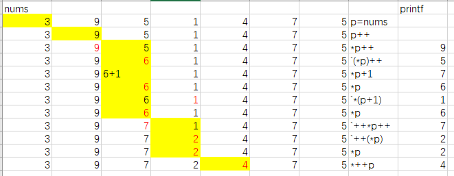

# 第五章 数组

数组由连续内存位置组成，最低地址对应第一个元素，最高地址对应最后一个元素

数组迎来存储多个同种类型的数据

数组的地址空间是连续的

**数组的名字指数组第一个元素的地址**

nums <==> &nums[0]

## 数组定义

**需要指定元素类型和元素数量**

```C
#include<stdio.h>
int main()
{
	int nums[10];
	return 0;
}
```

~~C99中支持变长数组，[]内可以是一个变量（不用）~~

```C
#include<stdio.h>
int main()
{
	int n = 10;
	int nums[n];
	return 0;
}
```

数组可以全部初始化为0

```C
#include<stdio.h>
int main()
{
	int nums[10] = { 0 };
	return 0;
}
```

也可以部分初始化为0

```C
#include<stdio.h>
int main()
{
	int nums[10] = { 1, 2, 3, 4 };
	return 0;
}
```

可以缺省数组长度

[]中不填写任何值，数组个数为赋值的个数

```C
#include<stdio.h>
int main()
{
	int nums[] = { 1, 2, 3, 4, 5, 6, 7, 8, 9, 0 };
	return 0;
}
```

## 数组的访问

数组中的单个元素可以通过下标访问，切记**不可超过数组最大下标**

## 数组支持随机访问

## 数组删除和插入的效率低

相对于链表而言

链表包含：
- 信息域
- 指针域

## 数组和指针的区别

数组是以某种类型为单位的连续的一段内存空间作为存储区域，其中存储相应的数据其变量名代表数组起始空间地址，也就是首元素的地址。 

指针的本质是内存中某一字节的地址，其存储在变量名所对应的内存空间中。

之所以说数组的本质是指针，是因为在在具体实现上，数组是基于指针实现的，编译器只提供了数组首元素的地址，因此在访问时需要使用首地址+偏移量的形式，所谓的偏移量由下标决定。

### 附加题

```C
#include<stdio.h>
int main()
{
	int nums[10] = { 3, 9, 5, 1, 4, 7, 5 };
	int* p = nums;
	p++;
	printf("%d\n", *p++);
	printf("%d\n", (*p)++);
	printf("%d\n", *p + 1);
	printf("%d\n", *p);
	printf("%d\n", *(p + 1));
	printf("%d\n", *p);
	printf("%d\n", ++*p++);
	printf("%d\n", ++(*p));
	printf("%d\n", *p);
	printf("%d\n", *++p);
	return 0;
}
```




### 根据scanf返回值判断输入数组长度

```C
#include<stdio.h>

int main() 
{
	int nums[100], i = 0, tmp;
	while (scanf("%d", &tmp))
	{
		nums[i] = tmp;
		i++;
	}
	printf("%d\n", i);
	for (int j = 0; j < i; j++)
	{
		printf("%d ", nums[j]);
	}
	return 0;
}
//输入停止记得摁 CTRL+z
```

## 习题

### 习题644 计算一个数组的平均值

#### 强制类型转换（在需要转换的变量前加括号，里面写需要转换的类型）

```C
int a = 2, b = 3;
printf("%.2f", (float)a / b);
```

#### 隐式类型转换

1. 向长度增加的方向进行，以保证精度不降低
   - 例如short和int在一起，会将short转换为int
2. 由简单类型向复杂类型转换
   - char -> short -> int -> float -> double
   - 1 -> 2 -> 4 -> 4 -> 8
   - **赋值运算时，赋值号右边类型强制转换为赋值号左边类型**

#### 格式控制


#### 代码实现

```C
#include<stdio.h> 

int main()
{
	int n;
	float avg, sum = 0;
	scanf("%d", &n);
	int nums[50] = { 0 };
	for (int i = 0; i < n; i++)
	{
		scanf("%d", &nums[i]);
	}
	for (int i = 0; i < n; i++)
	{
		sum += nums[i];
	}
	avg = sum / n;
	printf("%.2f", avg);
	return 0;
}
```

### 习题643 输出数组中最大值和最小值

#### [问题描述]

整型数组，输出最大值和最小值

#### [输入描述]

输入第一个数 n 表示数组长度，数组中的数字按空格分开输入

#### [输出描述]

数组下标从0开始

输出结果如下：

最大值

最小值

#### [输入样例1]

```text
8 
35 17 2 56 2 5 30 2
```

#### [输出样例1]

```text
最大值 56
最小值 2
```

#### 代码实现

```C
#include<stdio.h> 

int main()
{
	int n, max_num, min_num;
	scanf("%d\n", &n);
	int nums[50] = { 0 };
	max_num = nums[0];
	min_num = nums[0];
	for (int i = 0; i < n; i++)
	{
		scanf("%d", &nums[i]);
	}
	for (int i = 0; i < n; i++)
	{
		if (max_num < nums[i])
		{
			max_num = nums[i];
		}
		if (min_num > nums[i])
		{
			min_num = nums[i];
		}
	}
	printf("最大值 %d\n最小值 %d", max_num, min_num);
	return 0;
}
```

### 习题650 改变数组元素位置

#### [问题描述]

定义一个int型的一维数组，包含10个元素，分别赋值
   - 然后将数组中的元素都向前移一个位置，最后一个位置放的是第一个元素
   - 然后将数组中的元素都向后移一个位置，第一个位置放的是最后一个元素

#### [输入描述]

输入数组的10个元素.

#### [输出描述]

第一次移动数组中元素后，打印数组中元素，并用空格隔开；

第二次移动数组中元素后，打印数组中元素，并用空格隔开。

#### [输入样例1]

```text
1 2 3 4 5 6 7 8 9 10
```

#### [输出样例1]

```text
2 3 4 5 6 7 8 9 10 1 
1 2 3 4 5 6 7 8 9 10 
```

#### [输入样例2]

```text
1 3 5 7 9 2 4 6 8 0
```

#### [输出样例2]

```text
3 5 7 9 2 4 6 8 0 1
1 3 5 7 9 2 4 6 8 0
```

#### 代码实现

```C
#include<stdio.h> 

int main()
{
	int nums[10] = { 0 }, tmp;
	for (int i = 0; i < 10; i++)
	{
		scanf("%d", &nums[i]);
	}
	for (int i = 0; i < 9; i++)
	{
		tmp = nums[i];
		nums[i] = nums[i + 1];
		nums[i + 1] = tmp;
	}
	for (int i = 0; i < 10; i++)
	{
		printf("%d ", nums[i]);
	}
	printf("\n");
	for (int i = 9; i > 0; i--)
	{
		tmp = nums[i];
		nums[i] = nums[i - 1];
		nums[i - 1] = tmp;
	}
	for (int i = 0; i < 10; i++)
	{
		printf("%d ", nums[i]);
	}
	return 0;
}
```

### 习题654 求1000以内的素数

#### [题目描述]

质数（prime number）又称素数，有无限个。一个大于1的自然数，除了1和它本身外，不能被其他自然数整除。


#### [输入描述]

无

#### [输出描述]

无

#### [输入样例1]

无输入

#### [输出样例1]

```text
2
3
5
7
11
13
17
19
23
29
...
```

#### 代码实现

##### 逐个判断

```C
#include<stdio.h> 
#include<math.h>

int main()
{
	for (int i = 2; i < 1000; i++)
	{
		int flag = 0;
		for (int j = sqrt(i); j > 1; j--)
		{
			if (i % j == 0 && j != 1)
			{
				flag = 1;
				break;
			}
		}
		if (!flag)
		{
			printf("%d\n", i);
		}
	}
	return 0;
}
```

##### 厄拉多塞筛选法

素数从2开始，那么从2开始排除掉每个素数的倍数，就可以剩下所有的素数。

```C
#include<stdio.h>

// 厄拉多塞筛选法
int main()
{
	// 空间换时间，需要输出1000个素数，利用数组下标的话需要至少1001个元素
	int prime[1001] = { 0 };	// 假设全是素数
	for (int i = 2; i <= 1000; i++)
	{
		if (prime[i] == 0)	// 若为素数
		{
			printf("%d\n", i);	// 输出
			for (int j = i + i; j <= 1000; j += i)
			{
				prime[j] = 1;	// 素数的倍数不为素数，将其排除
			}
		}
	}
	return 0;
}
```

### 习题 校门外的树

#### [题目描述]

第一行有两个整数L（1 ≤ L ≤ 10000）和 M（1 ≤ M ≤ 100），L代表马路的长度，M代表区域的数目，L和M之间用一个空格隔开。接下来的M行每行包含两个不同的整数，用一个空格隔开，表示一个区域的起始点和终止点的坐标。
对于20%的数据，区域之间没有重合的部分；对于其它的数据，区域之间有重合的情况。


#### [输入描述]

无

#### [输出描述]

包括一行，这一行只包含一个整数，表示马路上剩余的树的数目。

#### [输入样例1]

```text
500 3
150 300
100 200
470 471
```

#### [输出样例1]

```text
298
```

#### 代码实现

10000米有10001棵树，n米有n+1棵树（有n+1个坐标值），故需要从0开始计算剩余树个数。

```C
#include<stdio.h>

int main()
{
	// 每一个端点都有树，10000米有10001棵树
	// 有树为0，无树为1
	int trees[10001] = { 0 }, length, zones, sum_trees = 0;
	scanf("%d%d", &length, &zones);
	for (int i = 0; i < zones; i++)
	{
		int start, end;
		scanf("%d%d", &start, &end);
		if (start >6= 0 && start < end && end <= length)
		{
			for (int j = start; j <= end; j++)
			{
				trees[j] = 1;
			}
		}
	}
	for (int i = 0; i <= length; i++)
	{
		if (!trees[i])
		{
			sum_trees++;
		}
	}
	printf("%d", sum_trees);
	return 0;
}
```

### 习题 约瑟夫环问题

#### [题目描述]

N个人围成一圈，从第一个人开始报数，数到M的人出圈；再由下一个人开始报数，数到M的人出圈；…输出依次出圈的人的编号。


#### [输入描述]

输入N和M。

#### [输出描述]

输出一行，依次出圈的人的编号。

#### [输入样例1]

```text
8 5
```

#### [输出样例1]

```text
5 2 8 7 1 4 6 3
```

#### [数据范围]

对于所有数据，2 ≤ N,M ≤ 1000。

#### 代码实现

```C
#include<stdio.h>

int main()
{
	int n, m, status[1001] = { 0 }, position = 0;
	scanf("%d%d", &n, &m);
	// 每个人都要出圈，控制出圈n次
	for (int i = 0; i < n; i++)
	{
		// 报数，计算谁出圈了
		for (int j = 1; j <= m; j++)
		{
			position++;
			if (position > n)
			{
				position = 1;
			}
			if (status[position])
			{
				j--;
			}
		}
		status[position] = 1;
		printf("%d ", position);
	}
	return 0;
}
```

课上案例

```C
#include<stdio.h>

int main()
{
	int n, m, status[1001] = { 0 }, position = 1;
	scanf("%d%d", &n, &m);
	int num_out = 0, call_out = 0;
	while (num_out != n)
	{
		if (position == n + 1)
		{
			position = 1;
		}
		if (!status[position])
		{
			call_out++;
		}
		if (call_out == m)
		{
			printf("%d ", position);
			status[position] = 1;
			call_out = 0;
			num_out++;
		}
		position++;
	}
	return 0;
}
```

参考(部分修改)

[链接](https://zhuanlan.zhihu.com/p/649290280)

```C
#include<stdio.h>

int main() {
	int n, m, pos = 1, vis[1000] = { 0 };
	scanf("%d%d", &n, &m);
	for (int i = 1; i <= n; i++) {
		// 一共出圈 n 次
		for (int i = 0; i < m; i++) {

			if (++pos > n) pos = 1;
			// 当前报数到最后一个了，下一次报数是第一个人 
			if (vis[pos]) i--;
			// 如果当前人已经出圈了，跳过 
		}
		if (pos - 1)
		{
			printf("%d ", pos - 1);
		}
		else
		{
			printf("%d ", n);
		}
		vis[pos] = 1;
	}
}
```
